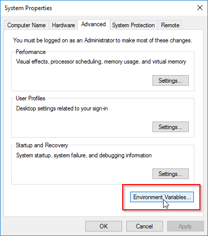
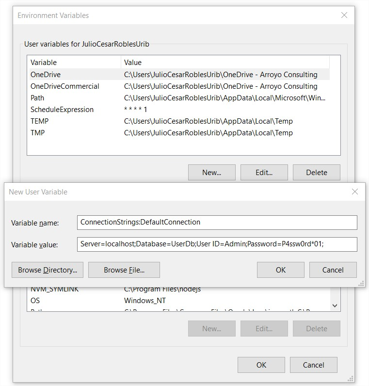

# Worker Service Sample
This is a sample implementation for a worker service that checks the status of a change in records in a database and executes a call to a web service with that data.

The application runs as a Windows service and extracts records from a database using the repository pattern and using the Dapper library.

Likewise, the service configuration uses a combination of environment variables and App Settings files.

# Projects
The current solution include the following projects:

- **WorkerService.App**: Contains the Main entry Point
- **WorkerService.Application**: Implements the Service Logic
- **WorkerService.Domain**: Defines the Entities and business models
- **WorkerService.Infrastructure**: Implements the database or external connections


# Steps
Here we describe the steps to implement this Service.

1. Adding Logging
2. Configuration and Environment
3. Schedule Execution
4. Health Check
5. Data Sources
6. Consume Web Services


## Adding Logging
First, we need to install the following Serilog NuGet packages into our app:

- Serilog - the main package
- Serilog.Extensions.Hosting - enables the use of IHostBuilder.UseSerilog()
- Serilog.Settings.Configuration - enables reading log configuration from appsettings.json
- Serilog.Sinks.Console - enables writing to the Console
- Serilog.Sinks.File - enables writing to log files
- Serilog.Formatting.Compact - compat the log
- Serilog.Enrichers.Environment - complement the logs with environment information
- Serilog.Extensions.Logging - Logging Extension to dynamic call

```code
dotnet add package Serilog
dotnet add package Serilog.Extensions.Hosting
dotnet add package Serilog.Extensions.Logging
dotnet add package Serilog.Enrichers.Environment
dotnet add package Serilog.Formatting.Compact
dotnet add package Serilog.Settings.Configuration
dotnet add package Serilog.Sinks.Console
dotnet add package Serilog.Sinks.File
```

Include the Configuration

```csharp
var builder = Host.CreateApplicationBuilder(args);

var logger = new LoggerConfiguration()
    .ReadFrom
    .Configuration(builder.Configuration)
    .Enrich.FromLogContext()
    .Enrich.WithMachineName()
    .CreateBootstrapLogger();

builder.Logging.ClearProviders();
builder.Logging.AddSerilog(logger);

builder.Services.AddHostedService<Worker>();

var host = builder.Build();

Log.Logger = logger;
Log.Information("Starting Working Service");

host.Run();
```

Add the configuration settings

```json
  "Serilog": {
    "Using": [
      "Serilog.Sinks.Console",
      "Serilog.Sinks.File"
    ],
    "MinimumLevel": {
      "Default": "Debug",
      "Override": {
        "Default": "Information",
        "System": "Warning",
        "Microsoft": "Warning",
        "Microsoft.Hosting.Lifetime": "Information"
      }
    },
    "WriteTo": [
      {
        "Name": "File",
        "Args": {
          "path": "logs/log.txt",
          "outputTemplate": "[{Timestamp:u} {Level:u3}] {Message:lj}{NewLine}{Exception}",
          "rollingInterval": "Day",
          "retainedFileCountLimit": 7,
          "shared": true
        }
      },
      {
        "Name": "Console",
        "Args": {
          "outputTemplate": "[{Timestamp:u} {Level:u3}] {Message:lj}{NewLine}{Exception}"
        }
      }
    ],
    "Enrich": [
      "FromLogContext",
      "WithMachineName",
      "WithThreadId"
    ],
    "Properties": {
      "Application": "WorkerServiceSample"
    }
  }
```

Execute and check the Logs

To more details you can chek these links:
- [How to Setup Serilog in Windows Service .NET Core Worker Projects](https://bojanveljanovski.com/posts/configuring-serilog-in-net-core-worker-and-windows-service-applications/)
- [How to Use Serilog with .NET8 Worker Template](https://www.youtube.com/watch?v=QJ-KX-_-gxI)

## Configuration and Environment
To avoid hardcoding sensitive information or writing these values to configuration files, we need to create environment variables that override these values with the actual values and can be used in the deployment process.

So, we need to create the same configuration values as Environment variables to override these values. Here we have an example for the Connection String to the database.

With the following Appsettings.json file

```json
{
  "Logging": {
    "LogLevel": {
      "Default": "Information",
      "Microsoft.Hosting.Lifetime": "Information"
    }
  },
  "ConnectionStrings": {
    "DefaultConnection": "%DefaultConnection%"
  },
    "ExternalUrlEndPoints": {
    "UserUrlEndPoint": "http://localhost/Users.asmx"
  },
  "Serilog": ...
  }
```
Create a section or key to save the value. and using the same name create the environment variable.



In this case you can create the environment variable using the same section names, for example:

```code
set ConnectionStrings:DefaultConnection="Server=localhost;Database=UserDb;User ID=Admin;Password=P4ssw0rd*01;"
```



Now into the program.cs we will do the following changes to add the environemnt variables.

```csharp
var builder = Host.CreateApplicationBuilder(args);

var configuration = builder.Configuration
    .AddEnvironmentVariables()
    .Build();

var logger = new LoggerConfiguration()
    .ReadFrom
    .Configuration(configuration)
    .Enrich.FromLogContext()
    .Enrich.WithMachineName()
    .CreateBootstrapLogger();

builder.Logging.ClearProviders();
builder.Logging.AddSerilog(logger);

builder.Services.AddHostedService<Worker>();

var host = builder.Build();

Log.Logger = logger;
Log.Information("Starting Working Service");

var connectionString = configuration.GetConnectionString("DefaultConnection")!;
Log.Information(connectionString);
var scheduleExpression = configuration.GetSection("ScheduleExpression").Value!;
Log.Information(scheduleExpression);

host.Run();
```

We ad the Environment variable into the configuration and you can use this calues inside the programa.

---

**NOTE**
Environment variables require you to reset the IDE and close the command window before you start using it.

---


## Schedule Execution

## Health Check

## Data Sources

## Consume Web Services
